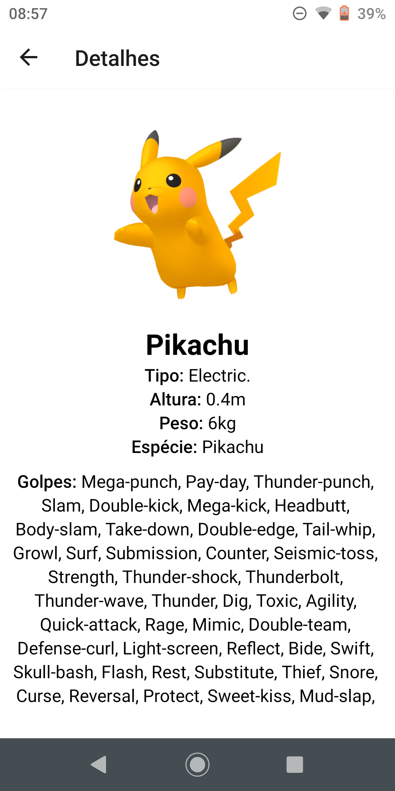

# Trabalho I DS151
Este repositório foi criado com o objetivo de armazenas o trabalho I da matéria "Desenvolvimento para Dispositivos Móveis". O trabalho foi feito através de React Native e Expo Go (usado para conseguir rodar a aplicação no smartphone).

##
### Instalação e uso
1. Clone esse repositório e acesse a pasta
   ```sh
   git clone https://github.com/MatheusKerscher/DS151_Matheus_Antonio_Kerscher_Trabalho-I.git
   cd DS151_Matheus_Antonio_Kerscher_Trabalho-I/
   ```
   
2. Instale os pacotes NPM
   ```sh
   npm install
   ```
   
3. Rode o App
   ```sh
   npm start
   ```
##
### Sobre o Aplicativo
Esse aplicativo consome a [PokéAPI](https://pokeapi.co/) e dentro desse aplicativo você consegue pesquisar por um pokémon e ao clicar no nome do pokémon um card sobre o pokémon é apresentado - esse card contém uma foto dele, o nome dele, sua altura e peso - e ao clicar no card você verá ver mais detalhes sobre ele, detalhes como:
- Uma imagem dele;
- Seu nome;
- Sua altura;
- Seu peso;
- Sua(s) espécie(s);
- Seus golpes.


##
### Imagens do aplicativo
A seguir encontram-se algumas imagens de como o aplicativo é


